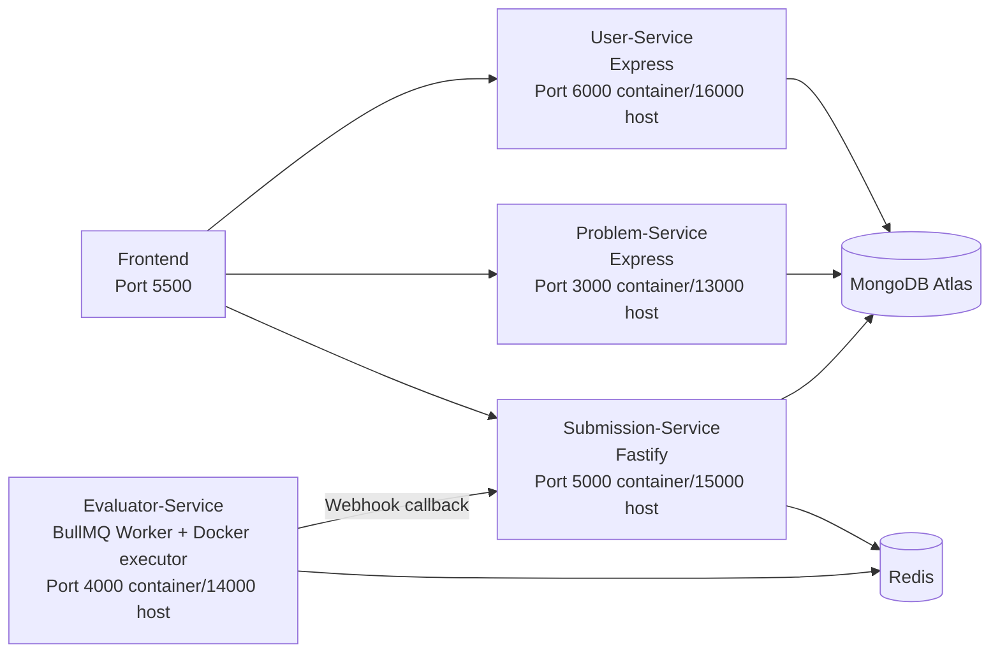
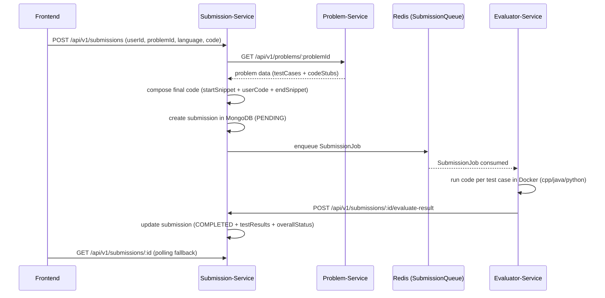

# Cloning Code Submission Platform Using Microservices - Comprehensive Architecture Documentation

## 1. Project Overview

This repository is a microservices-based coding platform inspired by LeetCode-style workflows:

- User registration/authentication
- Problem authoring and retrieval
- Code submission and asynchronous evaluation
- Frontend for browsing problems, submitting code, and tracking results

The system is split into independent services with Redis-backed queue communication for submission evaluation.

## 2. Repository Structure (Folder-by-Folder)

```text
.
├── User-Service/           # Auth + user profile management (Express + MongoDB)
├── Problem-Service/        # Problem CRUD + markdown sanitization (Express + MongoDB)
├── Submission-Service/     # Submission lifecycle + queue producer + webhook receiver (Fastify + MongoDB + Redis)
├── Evaluator-Service/      # Queue worker + Docker-based code execution + callback to submission service (Express + BullMQ + Dockerode)
├── Frontend/               # Static pages + lightweight proxy server (Node http)
├── docker-compose.yml      # Multi-container orchestration
├── .env.example            # Example env variables
└── .env                    # Local env (contains live credentials in current workspace)
```

## 3. High-Level Architecture



## 4. End-to-End Submission Lifecycle



## 5. Service-by-Service Deep Dive

## 5.1 User-Service

### Stack
- Express 5
- Mongoose
- JWT (`jsonwebtoken`)
- Password hashing (`bcryptjs`)
- Validation + custom error classes

### Responsibility
- User registration, login, token refresh
- Profile retrieval and profile/password updates
- JWT auth middleware for protected routes

### API Surface
Base path: `/api/v1/users`

- `POST /register`
- `POST /login`
- `POST /refresh`
- `GET /profile` (requires `Authorization: Bearer <token>`)
- `PUT /profile` (protected)
- `PUT /password` (protected)
- Health: `GET /ping`

### Data Model (`User`)
- `username` (unique, validated)
- `email` (unique, lowercased)
- `password` (hashed in pre-save hook)
- `firstName`, `lastName`
- `role` (`user | admin`)
- `isActive`
- timestamps

### Internal Layering
- Route -> Controller -> Service -> Repository -> Mongoose Model

### Security Notes
- Access + refresh token flow exists
- Protected APIs verify bearer token in middleware
- Password strength checks are implemented (uppercase/lowercase/number/special char)

## 5.2 Problem-Service

### Stack
- Express 5
- Mongoose
- `zod` request validation
- Markdown sanitation (`marked` + `sanitize-html` + `turndown`)

### Responsibility
- CRUD for coding problems
- Sanitization of markdown description content

### API Surface
Base path: `/api/v1/problems`

- `GET /ping`
- `GET /`
- `GET /:id`
- `POST /` (validated)
- `PUT /:id` (validated)
- `DELETE /:id`
- Health: service-level `GET /ping`

### Data Model (`Problem`)
- `title`, `description`, `difficulty`
- `testCases[]` (`input`, `output`)
- `codeStubs[]` (`language`, `startSnippet`, `userSnippet`, `endSnippet`)
- `editorial`
- timestamps

### Internal Layering
- Route -> Controller -> Service -> Repository -> Model
- Description is sanitized before create/update persistence

## 5.3 Submission-Service

### Stack
- Fastify
- Mongoose
- BullMQ (queue producer side)
- Redis (`ioredis`)
- Joi validation

### Responsibility
- Accept user submissions
- Fetch problem details from Problem-Service
- Build complete executable source from code stubs
- Store submission state/results
- Publish jobs to Redis queue (`SubmissionQueue`)
- Receive evaluator webhook callback and persist evaluation outcome

### API Surface
Base path: `/api/v1/submissions`

- `POST /` -> create submission
- `GET /` -> list user submissions (`userId`, `limit`, `offset`)
- `GET /:submissionId` -> fetch single submission
- `POST /:submissionId/evaluate-result` -> evaluator webhook callback

### Data Model (`Submission`)
Core fields:
- `userId`, `problemId`, `code`, `language`
- `status`: `PENDING | PROCESSING | COMPLETED | ERROR`

Evaluation fields:
- `testResults[]`
- `totalTestCases`, `passedTestCases`, `failedTestCases`
- `overallStatus`: `SUCCESS | PARTIAL | FAILED`
- `executionError`, `executionTime`, `completedAt`

Retry/idempotency fields:
- `idempotencyKey`
- `webhookAttempts`, `lastWebhookAttempt`, `nextRetryAt`, `webhookFailed`

### Internal Layering
- Fastify plugin decoration for repository/service instances
- Controllers use validation schemas and standardized response formatter
- Service orchestrates inter-service call + persistence + queue publishing

## 5.4 Evaluator-Service

### Stack
- TypeScript + Express
- BullMQ worker
- Dockerode (isolated code execution)
- Bull Board UI (`/ui`)

### Responsibility
- Consume `SubmissionQueue`
- Execute code per test case in isolated Docker containers
- Compare actual output vs expected output
- Build final evaluation result
- POST callback to Submission-Service webhook endpoint

### Execution Strategy
Supported languages:
- `python` -> `python:3.11-slim`
- `java` -> `eclipse-temurin:21-jdk-jammy`
- `cpp` -> `gcc:13`

Container restrictions:
- Memory limit (256MB)
- CPU limit (~1 CPU)
- PIDs limit
- `NetworkMode: none`
- Timeout handling (`TLE`) and output limit handling (`OLE`)

### Worker Flow
- Worker listens on queue `SubmissionQueue` for job `SubmissionJob`
- Job payload structure: keyed by submissionId with code/language/testCases/userId/problemId
- For each test case, executor returns status -> aggregate result -> webhook callback

## 5.5 Frontend

### Stack
- Plain HTML/CSS/JS pages
- Node.js HTTP server for static files + `/proxy/*` reverse proxy

### Responsibility
- Authentication pages (register/login)
- Problem list + individual problem solving page
- Submission history + profile management
- Submission status polling from Submission-Service

### Proxy Mapping (`Frontend/server.js`)
- `/proxy/user/*` -> `http://127.0.0.1:16000/*`
- `/proxy/problem/*` -> `http://127.0.0.1:13000/*`
- `/proxy/submission/*` -> `http://127.0.0.1:15000/*`

### Frontend Runtime Config (`js/config.js`)
The browser uses same-origin paths and talks to backend services through the local proxy.

## 6. Data and Storage Architecture

- Primary persistence: MongoDB Atlas (shared connection string across services in current env)
- Queue/message broker: Redis
- Queue name: `SubmissionQueue`
- Job type: `SubmissionJob`

## 7. Configuration and Environment Variables

### Shared
- `ATLAS_DB_URL`
- `LOG_DB_URL` (primarily used by Problem-Service logger)
- `NODE_ENV`

### User-Service
- `PORT`
- `JWT_SECRET`
- `JWT_EXPIRES_IN`
- `JWT_REFRESH_SECRET`
- `JWT_REFRESH_EXPIRES_IN`

### Submission-Service
- `PORT`
- `REDIS_HOST`, `REDIS_PORT`
- `PROBLEM_ADMIN_SERVICE_URL`
- (compose also defines timeout-related vars)

### Evaluator-Service
- `PORT`
- `REDIS_HOST`, `REDIS_PORT`
- `SUBMISSION_SERVICE_WEBHOOK_BASE_URL` (or fallback URL)

## 8. Deployment Architecture (Docker Compose)

Defined services:
- `user_service` (host `16000` -> container `6000`)
- `problem_service` (host `13000` -> container `3000`)
- `submission_service` (host `15000` -> container `5000`)
- `evaluator_service` (host `14000` -> container `4000`)
- `redis`

Network:
- `leetcode_network` bridge network

Special runtime dependency:
- Evaluator mounts `/var/run/docker.sock` to spawn execution containers from inside container.

## 9. Reliability and Error Handling

Implemented patterns:
- Service-local error middleware (all backend services)
- Queue producer retries (submission enqueue attempts with exponential backoff)
- Evaluator timeout and output-size protection
- Submission schema includes webhook retry metadata

Partially implemented / not fully wired:
- `WebhookRetryService` exists in Submission-Service but is not started in app bootstrap.
- Legacy `evaluationWorker.js` refers to `EvaluationQueue` and `sendPayload` endpoint not present in active architecture.

## 10. Security Posture

Positive controls:
- JWT auth middleware for protected user routes
- Password hashing and strength validation
- Problem markdown sanitation
- Code execution isolation with constrained Docker containers and no network

Risks found:
- `.env` in workspace currently contains real credentials/secrets.
- No API gateway-level auth propagation across Problem/Submission APIs (client passes `userId` directly for submissions).
- Submission-service webhook endpoint appears unauthenticated (relies on network trust).

## 11. Current Gaps and Inconsistencies Found During Analysis

1. Problem list query mismatch
- Frontend sends `page`, `limit`, `search`, `difficulty` query params.
- Problem-Service `getAllProblems()` currently returns all problems without explicit pagination/filter handling.

2. Submission status filter mismatch
- Frontend can send `status` filter in submissions page.
- Submission repository `findByUserId` ignores status filter (supports only userId/limit/offset).

3. Unused/legacy code path
- `Submission-Service/src/workers/evaluationWorker.js` references `EvaluationQueue` and endpoint `http://localhost:3001/sendPayload` not used by active flow.

4. Webhook retry framework not activated
- Retry service class exists but no startup registration in app init.

## 12. API Contract Summary

### User-Service
- Request/response contract follows `{ success, message, data }` shape.
- Auth token in `Authorization` header for protected routes.

### Problem-Service
- CRUD API returns standardized `{ success, message, error, data }` pattern.

### Submission-Service
- `POST /submissions` requires:
  - `userId`, `problemId`, `language` (`cpp|java|python`), `code`
- `POST /submissions/:id/evaluate-result` expects evaluator payload:
  - `submissionId`, `userId`, totals, status, `testResults`, `executionTime`

## 13. Observability

- Problem-Service and User-Service use Winston logging.
- Submission-Service uses custom JSON logger class.
- Evaluator uses console logging and Bull Board UI.
- Bull Board dashboard endpoint: `http://<evaluator-host>:4000/ui` (inside compose mapped to host `14000/ui`).
- Grafana dashboard has been added to the documentation assets for monitoring visibility:
  - `docs/images/grafana.png`

## 14. Suggested Documentation Evolution

Recommended docs to add next:
- `docs/API_REFERENCE.md` (full request/response examples)
- `docs/LOCAL_SETUP.md` (dev and docker workflows)
- `docs/SECURITY.md` (token strategy, webhook auth, secret handling)
- `docs/OPERATIONS.md` (queue monitoring, failure playbooks, scaling)

## 15. Quick Runbook (Based on Current Layout)

1. Configure `.env` from `.env.example` with valid values.
2. Start backend services with `docker compose up --build`.
3. Start frontend in separate shell:
   - `cd Frontend`
   - `npm run dev`
4. Open `http://localhost:5500`.

## 16. Final Notes

The repository already has a clear microservice split and a working async evaluation backbone (Submission -> Redis -> Evaluator -> webhook callback). The most impactful next improvements are:

- Align frontend filters with backend query capabilities.
- Enforce stronger auth/authorization around submission ownership and webhook trust.
- Activate/reconcile retry and legacy worker paths.
