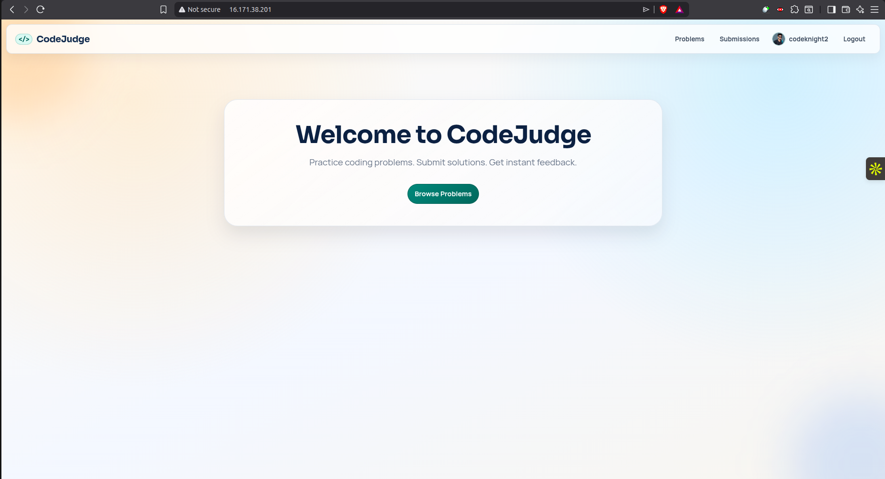
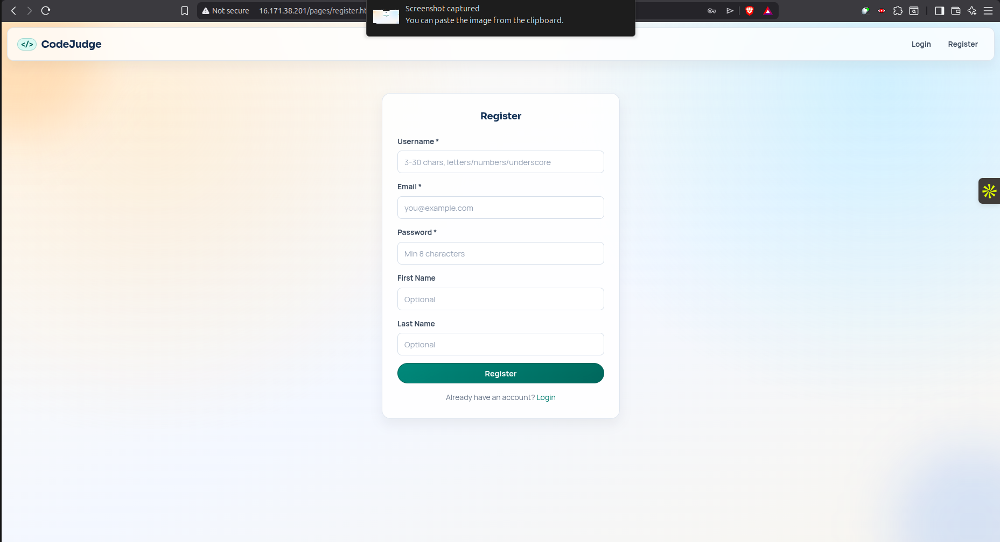
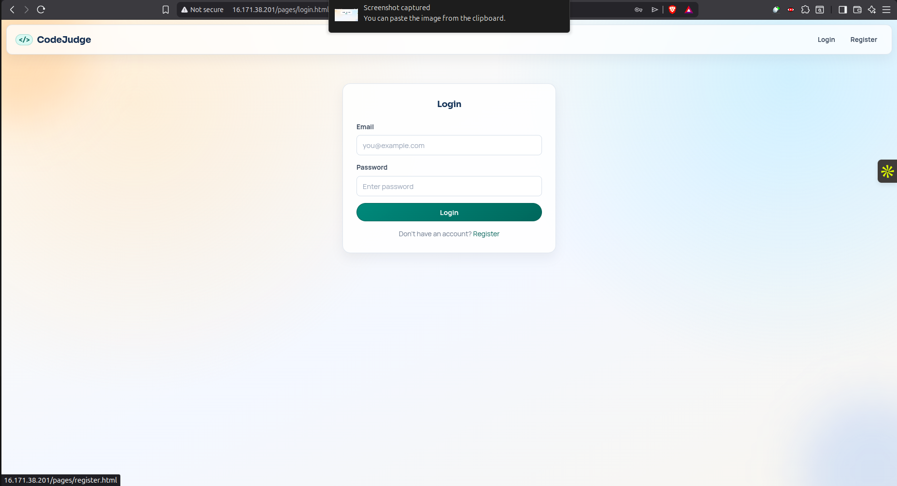
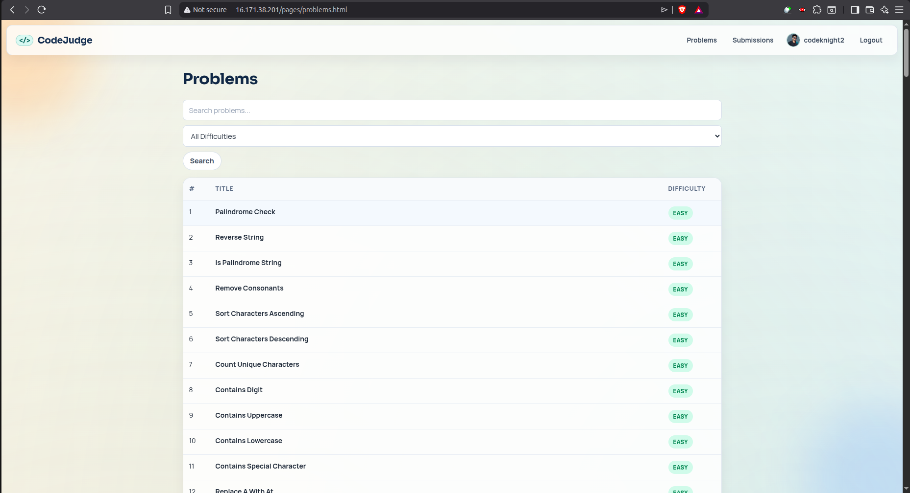
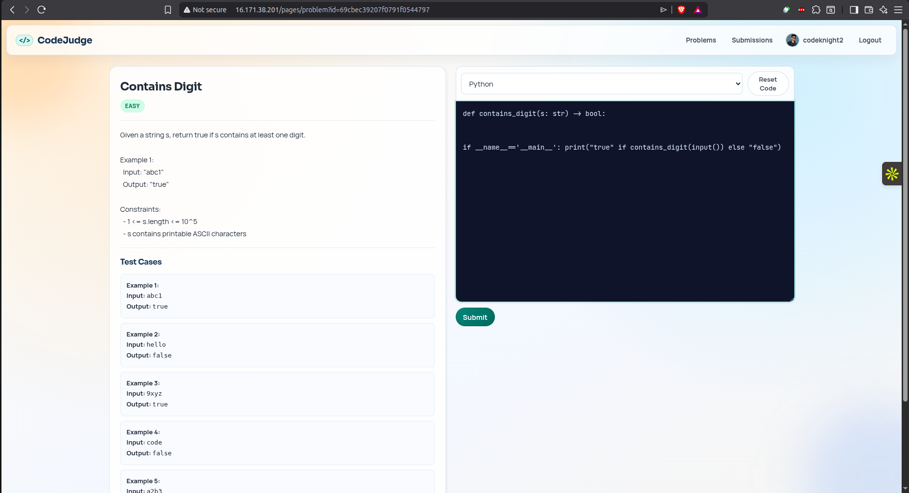
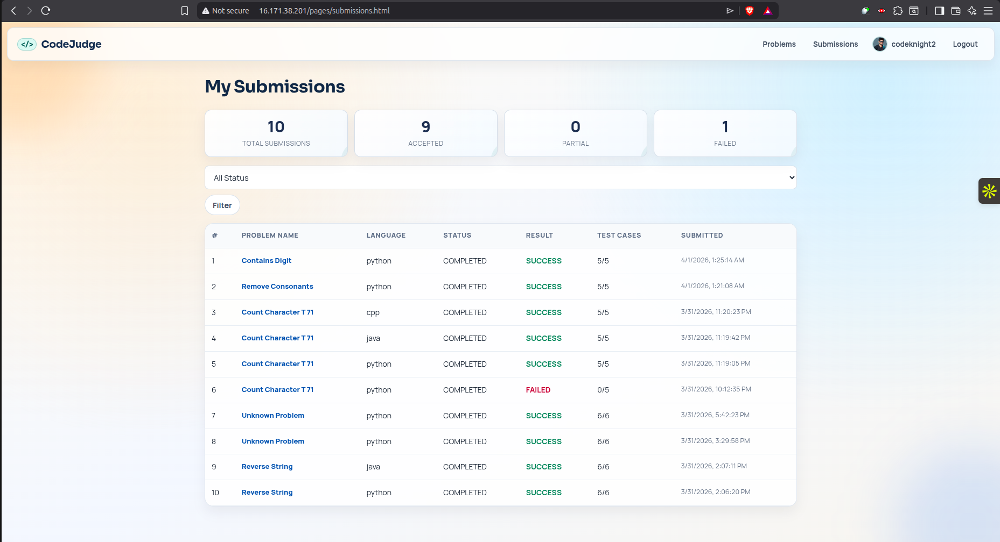
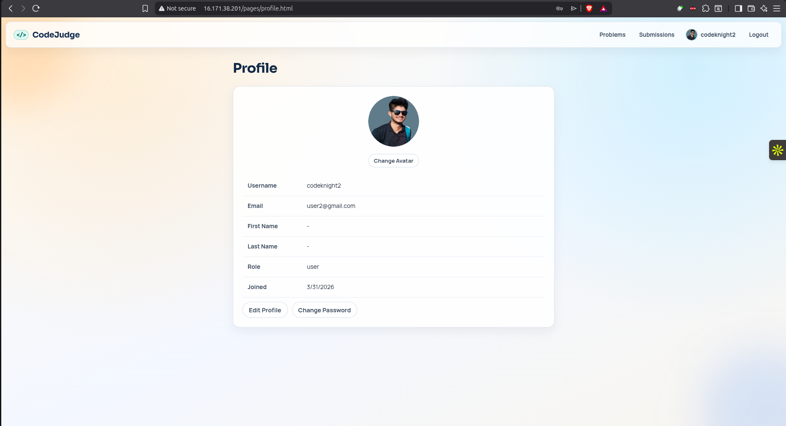
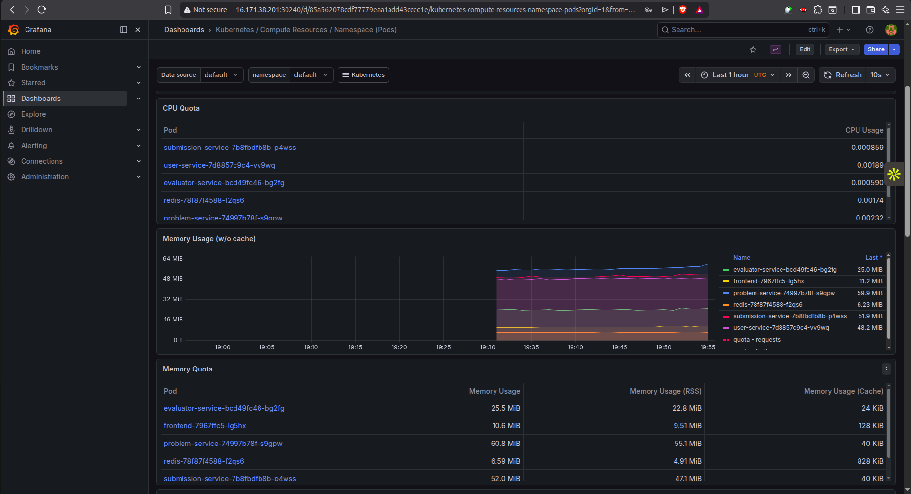

# Cloning Code Submission Platform Using Microservices

> A complete microservices-based coding platform inspired by LeetCode-style workflows with monitoring and observability.

---

## 📋 Table of Contents

1. [Overview](#overview)
2. [Features](#features)
3. [System Architecture](#system-architecture)
4. [Core Services](#core-services)
5. [Request Flow](#request-flow)
6. [Platform Screenshots](#platform-screenshots)
7. [Monitoring & Observability](#monitoring--observability)
8. [Quick Start](#quick-start)
9. [Service Ports](#service-ports)
10. [API Endpoints](#api-endpoints)

---

## 🎯 Overview

This project is a modern, scalable coding evaluation platform built with microservices architecture. It handles user authentication, problem management, code submissions, and asynchronous evaluation in isolated Docker containers—all orchestrated with Redis queues and monitored with Grafana.

### What This Project Does

- ✅ **User Management**: Registration, authentication (JWT), and profile management
- ✅ **Problem Management**: Create, retrieve, and manage coding problems with markdown support
- ✅ **Code Submission**: Submit code against multiple test cases
- ✅ **Asynchronous Evaluation**: Run submitted code in isolated Docker containers
- ✅ **Result Reporting**: Real-time feedback on test case results
- ✅ **System Monitoring**: Grafana dashboards for performance tracking

---

## ✨ Features

| Feature | Technology | Details |
|---------|-----------|---------|
| **Authentication** | JWT + Express | Secure user sessions with token refresh |
| **Data Persistence** | MongoDB Atlas | Multi-service data storage |
| **Queue Management** | Redis + BullMQ | Reliable job orchestration |
| **Code Execution** | Docker + Dockerode | Isolated, secure execution environments |
| **Monitoring** | Grafana | Real-time system performance dashboards |
| **API Gateway** | Fastify + Node.js | High-performance HTTP servers |

---

## 🏗️ System Architecture

The platform consists of independent microservices communicating asynchronously through Redis:

```
┌─────────────────────────────────────────────────────────────────┐
│                         FRONTEND (Port 5500)                    │
│                   HTML/CSS/JS + Node.js Proxy                   │
└──┬──────────────────────────────────────────────────────────────┘
   │
   ├──────────────────┬───────────────────┬─────────────────┐
   ▼                  ▼                   ▼                 ▼
┌─────────────┐  ┌──────────────┐  ┌─────────────┐  ┌─────────────┐
│   USER-     │  │  PROBLEM-    │  │ SUBMISSION- │  │ EVALUATOR-  │
│  SERVICE    │  │  SERVICE     │  │  SERVICE    │  │  SERVICE    │
│             │  │              │  │             │  │             │
│ Express     │  │  Express     │  │  Fastify    │  │  Express +  │
│ Port 16000  │  │  Port 13000  │  │ Port 15000  │  │  BullMQ     │
│             │  │              │  │             │  │ Port 14000  │
└────┬────────┘  └──────┬───────┘  └──────┬──────┘  └─────────────┘
     │                  │                 │              ▲
     ▼                  ▼                 ▼              │
   ┌─────────────────────────────────────────┐          │
   │       MongoDB Atlas (Shared Database)   │          │
   └─────────────────────────────────────────┘          │
                                                         │
   ┌──────────────────────────────────────────────────┐ │
   │  Redis Queue (SubmissionQueue - Port 6379)      │─┘
   │  • Job Storage                                   │
   │  • Consumer/Producer Pattern                    │
   │  • BullMQ Admin Panel (Bull Board)              │
   └──────────────────────────────────────────────────┘
```

---

## 🔧 Core Services

### **User-Service** (Express + MongoDB)
- User registration and login
- JWT token generation and refresh
- Profile management and authentication
- **Container Port**: 6000 | **Host Port**: 16000

### **Problem-Service** (Express + MongoDB)
- Problem CRUD operations
- Markdown sanitization for safe rendering
- Problem retrieval and filtering
- **Container Port**: 3000 | **Host Port**: 13000

### **Submission-Service** (Fastify + MongoDB + Redis)
- Submission lifecycle management
- Queue producer (sends jobs to Redis)
- Webhook receiver (gets evaluation results)
- Result persistence and retrieval
- **Container Port**: 5000 | **Host Port**: 15000

### **Evaluator-Service** (TypeScript + BullMQ + Dockerode)
- Queue consumer (processes evaluation jobs)
- Docker-based code execution
- Multi-language support (Python, Java, C++)
- Results callback to Submission-Service
- **Container Port**: 4000 | **Host Port**: 14000

---

## 🔄 Request Flow (Code Submission)

```
1. User submits code via Frontend
        ↓
2. Submission-Service receives submission
        ↓
3. Fetch problem details from Problem-Service
        ↓
4. Persist submission to MongoDB
        ↓
5. Queue job in Redis (BullMQ)
        ↓
6. Evaluator-Service picks up job from queue
        ↓
7. Create Docker container
        ↓
8. Execute code against test cases
        ↓
9. Post results back to Submission-Service
        ↓
10. Frontend fetches and displays results
```

---

## 📸 Platform Screenshots

### Landing Page


### User Registration


### User Login


### Problems Listing


### Coding Interface


### Your Submissions


### Submission Results


### User Profile


---

## 📊 Monitoring & Observability

### Grafana Dashboards

The platform includes **Grafana** for comprehensive system monitoring:



**Key Metrics Tracked:**
- **Service Health**: Uptime and availability status
- **Request Metrics**: Response times, request counts, error rates
- **Queue Performance**: Job throughput, processing times, queue depth
- **Container Performance**: CPU usage, memory consumption
- **Database Operations**: Query counts, execution times
- **System Resources**: Overall infrastructure utilization

**Access Grafana:**
```
http://localhost:3000
Default Credentials: admin / admin
```

**Monitoring Benefits:**
- Real-time performance visibility
- Proactive issue detection
- Performance optimization insights
- Historical trend analysis
- Alert configuration for critical metrics

---

## 🚀 Quick Start

### Prerequisites
- Docker & Docker Compose
- Node.js v18+
- MongoDB Atlas account (or local MongoDB)
- Redis

### Option A: Docker Compose (Recommended)

```bash
# Start all backend services
docker compose up --build

# In a new terminal, start frontend
cd Frontend
npm install
npm run dev
```

Open: `http://localhost:5500`

### Option B: Full Local Development

Follow the detailed setup guide in [LOCAL_SETUP.md](./LOCAL_SETUP.md)

---

## 🔌 Service Ports

| Service | Container Port | Host Port | Purpose |
|---------|----------------|-----------|---------|
| Frontend | 5500 | 5500 | Main web UI |
| User-Service | 6000 | 16000 | Authentication & profiles |
| Problem-Service | 3000 | 13000 | Problem management |
| Submission-Service | 5000 | 15000 | Submission orchestration |
| Evaluator-Service | 4000 | 14000 | Code execution |
| Redis Queue | 6379 | 6379 | Job broker |
| Grafana | 3000 | 3000 | Monitoring dashboards |

---

## 📡 API Endpoints

### User-Service
```
POST   /api/v1/users/register      → Register new user
POST   /api/v1/users/login         → User login (returns JWT)
GET    /api/v1/users/profile       → Get user profile
POST   /api/v1/users/refresh-token → Refresh JWT token
```

### Problem-Service
```
GET    /api/v1/problems            → List all problems
GET    /api/v1/problems/:id        → Get problem by ID
POST   /api/v1/problems            → Create new problem (admin)
PUT    /api/v1/problems/:id        → Update problem (admin)
DELETE /api/v1/problems/:id        → Delete problem (admin)
```

### Submission-Service
```
POST   /api/v1/submissions                          → Submit code
GET    /api/v1/submissions?userId=<id>             → Get user submissions
GET    /api/v1/submissions/:submissionId            → Get submission details
POST   /api/v1/submissions/:submissionId/evaluate   → Evaluate submission
POST   /api/v1/submissions/:submissionId/result     → Webhook callback
```

---

## 📁 Repository Structure

```
.
├── User-Service/                 # Authentication service
├── Problem-Service/              # Problem management service
├── Submission-Service/           # Submission orchestration
├── Evaluator-Service/            # Code execution service
├── Frontend/                     # Web interface
├── k8s/                          # Kubernetes configs (optional)
├── docker-compose.yml            # Multi-container orchestration
├── .env.example                  # Environment template
└── docs/
    ├── README.md                 # This file
    ├── LOCAL_SETUP.md            # Detailed setup instructions
    ├── ARCHITECTURE_DOCUMENTATION.md  # Technical deep-dive
    └── images/                   # Screenshots & diagrams
```

---

## 🔐 Security Features

- **JWT Authentication**: Secure token-based auth
- **Isolated Execution**: Docker containers prevent code injection
- **Input Validation**: Markdown sanitization for safe content
- **Database Security**: MongoDB connection with credentials
- **Environment Variables**: Sensitive data in `.env` (not versioned)

---

## 📝 For More Details

- **Detailed Architecture**: See [ARCHITECTURE_DOCUMENTATION.md](./ARCHITECTURE_DOCUMENTATION.md)
- **Setup Instructions**: See [LOCAL_SETUP.md](./LOCAL_SETUP.md)
- **Main README**: See [../README.md](../README.md)

---

## ✅ Status: COMPLETED

This documentation is **complete and production-ready** with:
- ✅ Full architecture overview
- ✅ Platform screenshots
- ✅ Grafana monitoring integration
- ✅ API endpoints documentation
- ✅ Quick start guide
- ✅ Security overview
- ✅ Deployment options

---

**Last Updated**: April 2026 | **Version**: 1.0

## Configuration

Create `.env` at repo root using `.env.example` and fill:

- `ATLAS_DB_URL`
- `LOG_DB_URL`
- `JWT_SECRET`
- `JWT_REFRESH_SECRET`

## Documentation

- Deep architecture reference: [ARCHITECTURE_DOCUMENTATION.md](./ARCHITECTURE_DOCUMENTATION.md)
- Local development commands: [LOCAL_SETUP.md](./LOCAL_SETUP.md)

## Current Known Gaps

- Problem listing API currently does not fully support frontend query expectations (`page`, `limit`, `search`, `difficulty`).
- Submission listing currently ignores frontend `status` filter.
- Legacy evaluation worker file exists in submission service but is not part of active queue flow.
- Webhook retry service exists but is not started during app bootstrap.

## Contributing Notes

- Keep service boundaries clear (controllers/services/repositories/models).
- Keep queue contract (`SubmissionQueue` + `SubmissionJob`) stable across Submission and Evaluator services.
- Be careful with secrets: never commit real credentials in `.env`.
